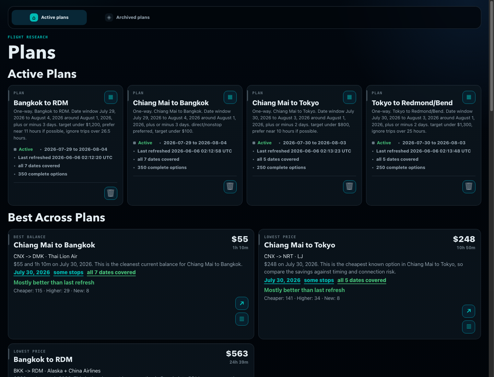
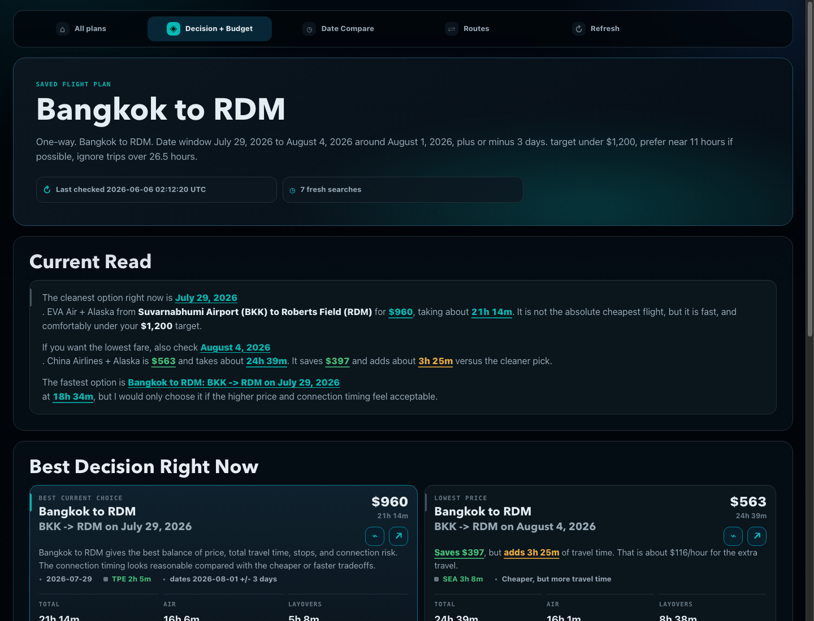
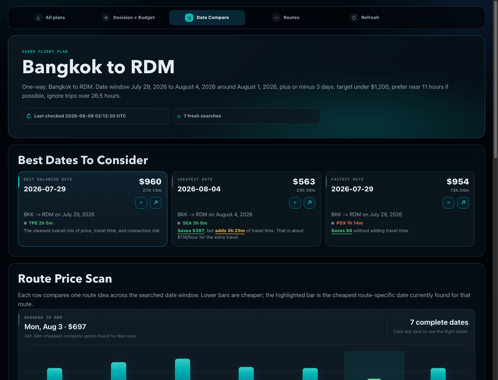
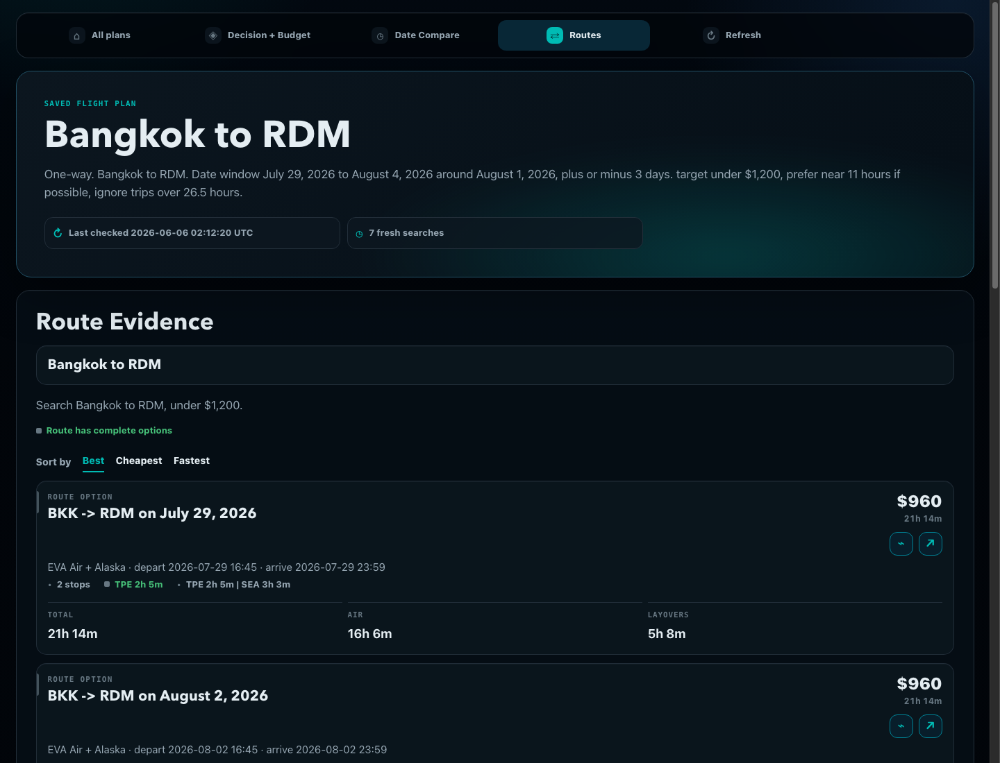

# Flight Research Agent

Find better flights without turning travel planning into a browser-tab maze.

Flight Research Agent turns a rough travel idea into a saved local flight plan. You can describe flexible dates, rough budget, airports you are unsure about, stopovers you might accept, and travel days you want to avoid. The app searches the plan, saves snapshots, and builds dashboards that explain the best options in plain language.

It is built for personal flight research: compare dates, routes, prices, total travel time, and connection risk before you verify and book with Google Flights or an airline.

## What It Does

- Searches flexible date windows, such as August 1 plus or minus 3 days.
- Compares the best balance, cheapest, fastest, and risky-but-interesting options.
- Tracks refreshes so you can see what got cheaper, higher, or newly available.
- Shows flight detail sidecards with legs, layovers, timing, and Google Flights links.
- Keeps plans, caches, snapshots, and generated dashboards on your machine.

## Screenshots









## Quick Start

You need:

- Node.js 20 or newer
- Python 3.11 or newer

Clone the repo, install the local stack, and start the dashboard:

```bash
git clone https://github.com/gateway/flight-scout.git
cd flight-scout
npm run setup
npm run serve
```

Then open [http://127.0.0.1:8765/](http://127.0.0.1:8765/).

Want to open it from another device on your LAN or Tailscale network?

```bash
npm run serve:lan
```

Then open:

```text
http://<your-computer-ip>:8765/
```

The normal `npm run serve` command only listens on `127.0.0.1`, which means the dashboard is available from the same machine only.

`npm run setup` creates the project virtual environment for you, installs the flight search dependency, and writes the local `.env` file. You do not need to manually create a Python environment.

The app uses one direct Python flight-search dependency:

```text
flights==0.9.0
```

The search layer requests USD results with US English locale settings so prices stay consistent even when you are traveling.

## Use It With An Assistant

The dashboard is the local app. The skill is the assistant layer that turns your rough travel request into the right local app commands.

Today, the packaged skill is for Codex. To install it:

```bash
npm run skill:install
```

That copies `skills/flight-plan-riffer` into your Codex skills folder:

```text
~/.codex/skills/flight-plan-riffer
```

If you set `CODEX_HOME`, it installs into:

```text
$CODEX_HOME/skills/flight-plan-riffer
```

Then restart Codex or start a new Codex session and ask with `$flight-plan-riffer`.

This command does not install Codex for you. You still need a Codex environment that supports local skills, such as the Codex desktop app or a Codex CLI/session with access to this project folder.

Claude or another assistant can still use the project by following the command docs, but Claude Desktop will not automatically load the Codex skill format. A separate Claude/MCP-style integration would be a future adapter, not the current install path.

Good starter prompts:

```text
Use $flight-plan-riffer. Find one-way flights from Bangkok to Redmond, Oregon around August 1, 2026, plus or minus three days. Keep it under 26 hours and around $1,200 if possible.
```

```text
Use $flight-plan-riffer. Compare flying from Chiang Mai straight home versus starting from Bangkok first. I care most about saving money, but I do not want a brutal travel day.
```

```text
Use $flight-plan-riffer. Find Chiang Mai to Tokyo around August 1, plus or minus two days. Check both Tokyo airports, keep it under $800 if possible, and prefer under 10 hours.
```

```text
Use $flight-plan-riffer. Refresh my saved flight plan and tell me what changed since the last scan.
```

The skill is designed to ask short clarifying questions when something important is missing. When the request is clear, it repeats the plan back first so you can confirm the airports, dates, route ideas, and filters before it searches.

The dashboard app itself is local and command-driven, so another assistant or workflow can use the same plan files and commands later.

## What You Get Back

Each saved plan can generate:

- **Current read:** the clearest next move in normal language.
- **Best choices:** balanced, cheapest, fastest, and notable tradeoffs.
- **Date compare:** which departure dates look strongest.
- **Route evidence:** the flight options behind the recommendation.
- **Flight sidecards:** legs, travel time, layovers, and Google Flights links.
- **Refresh history:** what changed since the previous scan.

## Local Data

Your generated plans, caches, snapshots, outputs, virtual environment, and `.env` file stay local and are ignored by git by default.

This repo should not include your personal trip data, API keys, local environment files, or generated dashboard outputs.

## More Docs

- [Getting Started](docs/GETTING_STARTED.md)
- [Example Prompts](docs/EXAMPLE_PROMPTS.md)
- [Codex Skill Usage](docs/CODEX_SKILL_USAGE.md)
- [Command Reference](docs/COMMAND_REFERENCE.md)
- [Troubleshooting](docs/TROUBLESHOOTING.md)
- [Security And Privacy](docs/SECURITY_AND_PRIVACY.md)

## Important Limit

Flight Research Agent is a research tool, not a booking engine. Always verify the final fare, baggage rules, separate-ticket risk, and booking details before buying.
